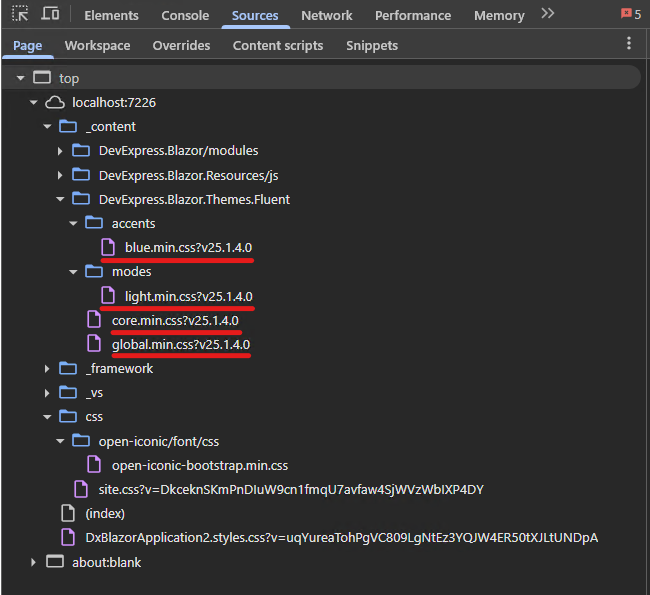

<!-- default badges list -->

<!-- default badges end -->
# Theming - How to utilize DevExpress theme variables in own styles

This example demonstrates how to reference and override DevExpress theme variables and apply them to different elements.

Built-in DevExpress variables are overidden for DxButton, DxGrid, and standard elements such as `div`.

A list of all generated variables can be found in the source files:

## Files to Review

- [Index.razor](CS/DxThemeVariablesExample/Components/Pages/Index.razor)

## Documentation

- [CSS Customization: Inspect CSS Rules](https://docs.devexpress.com/GeneralInformation/404498/css-customization/inspect-css-rules)
- [Styling and Themes: Customize a Theme](https://docs.devexpress.com/Blazor/401523/styling-and-themes/themes#customize-a-theme-add-stylesheets)

<!-- feedback -->
## Does this example address your development requirements/objectives?

 

(you will be redirected to DevExpress.com to submit your response)
<!-- feedback end -->

