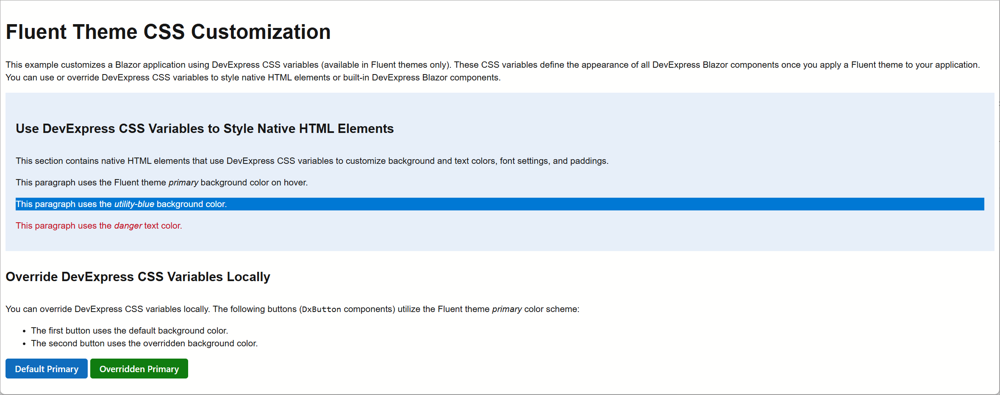

<!-- default badges list -->

[](https://supportcenter.devexpress.com/ticket/details/T1304606)
[](https://docs.devexpress.com/GeneralInformation/403183)
[](#does-this-example-address-your-development-requirementsobjectives)
<!-- default badges end -->
# Blazor - Use CSS Variables to Customize DevExpress Fluent Themes

This example customizes a DevExpress-powered Blazor application using DevExpress CSS variables available in Fluent themes. DevExpress Blazor components ship with a predefined set of CSS variables that define component appearance (once you apply a [Fluent theme](https://docs.devexpress.com/Blazor/401523/styling-and-themes/themes#apply-a-fluent-theme) to your application). You can use these DevExpress CSS variables as follows:
* Style native HTML elements to maintain a consistent look across your application.
* Customize built-in DevExpress Blazor components.



Refer to the [Design System](https://docs.devexpress.com/DesignSystem/405636/foundation) help topics to learn more about key styling principles and see full lists of CSS variables available in DevExpress Blazor Fluent themes.

## Implementation Details

This example customizes native HTML and DevExpress elements using CSS classes. The example stores CSS rules in a separate [dx-variables.css](./CS/DxThemeVariablesExample/wwwroot/css/custom/dx_variables.css) stylesheet and passes it as a parameter to the [AddFilePath](https://docs.devexpress.com/Blazor/DevExpress.Blazor.ThemeProperties.AddFilePaths(System.String--)) method when you register a Fluent theme.

### Use DevExpress CSS Variables to Style Native HTML Elements

This example assigns the folowing CSS classes to native HTML elements:

* `<div class="container-with-devexpress-styles">`  
   Changes background color, font settings, and paddings.
* `<p class="hovered">`  
   Applies the Fluent theme's *primary* background color on hover.
* `<p class="utility-blue">`  
   Applies the *utility-blue* background color and *neutral* text color.
* `<p class="danger">`  
   Applies the *danger* text color.

```CSS
.container-with-devexpress-styles {
    font-size: var(--dxds-font-size-base-md);
    font-weight: var(--dxds-font-weight-base-default);
    padding: var(--dxds-spacing-160);
    background-color: var(--dxds-color-surface-primary-subdued-rest);
}

.container-with-devexpress-styles strong {
    font-weight: var(--dxds-font-weight-base-stronger);
}

.container-with-devexpress-styles .utility-blue {
    background-color: var(--dxds-color-surface-utility-blue-default-rest);
    color: var(--dxds-neutral-10);
}

.container-with-devexpress-styles .danger {
    color: var(--dxds-color-content-danger-default-rest);
}

.container-with-devexpress-styles .hovered:hover {
    background-color: var(--dxds-color-surface-primary-subdued-hovered);
}
```

### Use CSS Variables for Style Isolation

You can use DevExpress CSS variables for style isolation. In this example, both [DevExpress Blazor Buttons](https://docs.devexpress.com/Blazor/DevExpress.Blazor.DxButton) utilize the Fluent theme's *primary* [color scheme](https://docs.devexpress.com/Blazor/DevExpress.Blazor.DxButton.RenderStyle):
* The first button uses the default background color.
* The second button uses the overridden background color.

```Razor
<DxButton RenderStyle="ButtonRenderStyle.Primary" Text="Default Primary" />
<DxButton RenderStyle="ButtonRenderStyle.Primary"
          Text="Overridden Primary"
          CssClass="button-with-custom-background" />
```

```CSS
.button-with-custom-background {
    --dxds-color-surface-primary-default-rest: var(--dxds-color-surface-utility-green-default-rest);
}
```

### Use DevExpress CSS Variables to Customize Elements Within DevExpress Components

You can utilize DevExpress CSS variables to customize individual elements within DevExpress components. The [Grid](https://docs.devexpress.com/Blazor/403143/components/grid) below uses the Fluent theme *primary* color to change header cell and hovered row appearance (via the [CustomizeElement](https://docs.devexpress.com/Blazor/DevExpress.Blazor.DxGrid.CustomizeElement) event):

```Razor
<DxGrid Data="Customers"
        CssClass="grid-with-custom-styles"
        HighlightRowOnHover="true"
        CustomizeElement="OnCustomizeElement">
    <Columns>
        @* ... *@
    </Columns>
</DxGrid>
```

```csharp
private void OnCustomizeElement(GridCustomizeElementEventArgs args) {
    if(args.ElementType == GridElementType.HeaderCell) {
        args.CssClass = "custom-grid-header";
    }
}
```

```CSS
.grid-with-custom-styles {
    --dxds-color-surface-neutral-default-hovered: var(--dxds-color-surface-primary-default-hovered);
    --dxds-color-content-neutral-default-hovered: var(--dxds-color-content-neutral-default-static-dark-hovered);
}

.grid-with-custom-styles .custom-grid-header {
    background-color: var(--dxds-color-surface-primary-default-rest) !important;
    color: var(--dxds-color-content-neutral-default-static-dark-hovered) !important;
}
```

## Files to Review

- [Index.razor](CS/DxThemeVariablesExample/Components/Pages/Index.razor)
- [App.razor](CS/DxThemeVariablesExample/Components/App.razor)
- [dx-variables.css](CS/DxThemeVariablesExample/wwwroot/css/custom/dx_variables.css)

## Documentation

- [Design System Foundation](https://docs.devexpress.com/DesignSystem/405636/foundation)
- [CSS Variables in DevExpress Blazor Fluent Themes](https://docs.devexpress.com/Blazor/405705/styling-and-themes/fluent-theme-customization/fluent-css-variables)
- [CSS Customization: Inspect CSS Rules](https://docs.devexpress.com/GeneralInformation/404498/css-customization/inspect-css-rules)
- [Styling and Themes: Customize a Theme](https://docs.devexpress.com/Blazor/401523/styling-and-themes/themes#customize-a-theme-add-stylesheets)

<!-- feedback -->
## Does this example address your development requirements/objectives?

[](https://www.devexpress.com/support/examples/survey.xml?utm_source=github&utm_campaign=blazor-use-devexpress-theme-variables&~~~was_helpful=yes) [](https://www.devexpress.com/support/examples/survey.xml?utm_source=github&utm_campaign=blazor-use-devexpress-theme-variables&~~~was_helpful=no)

(you will be redirected to DevExpress.com to submit your response)
<!-- feedback end -->


